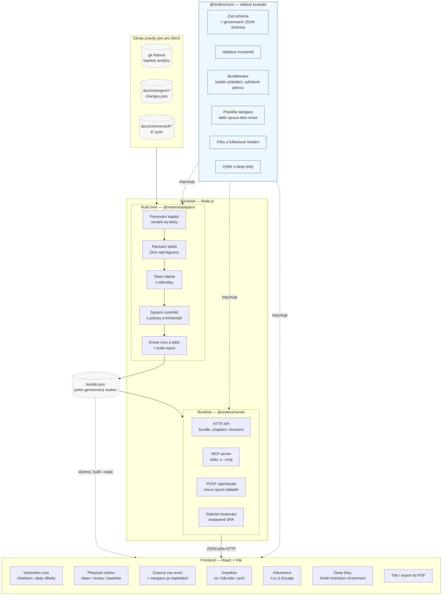
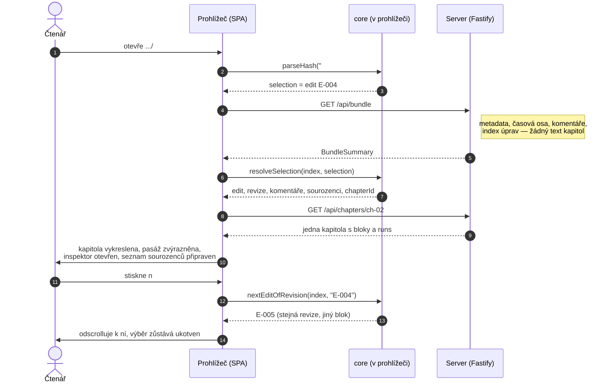
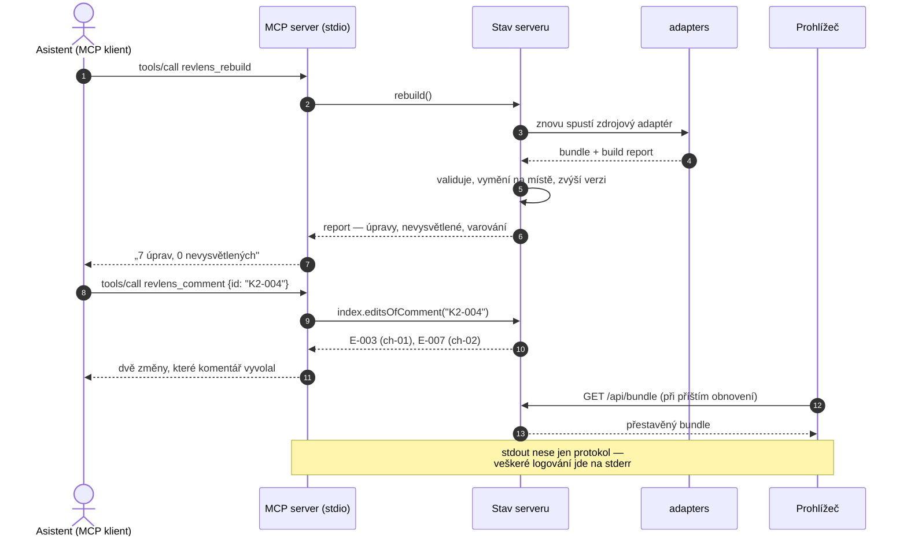
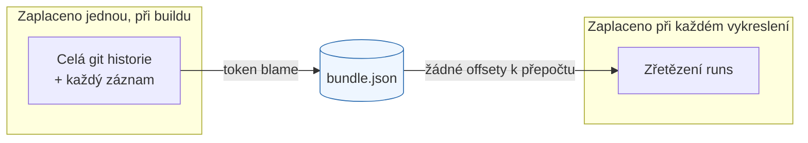

# Architektura RevLens

> Tento soubor je **český překlad** dokumentu [`ARCHITECTURE.md`](ARCHITECTURE.md)
> (anglický originál — zdroj pravdy). Při jakékoli úpravě obsahu synchronizuj obě
> verze; pokud se rozcházejí, platí anglická.

## Přehled

Jak je práce rozdělená mezi backend a frontend a proč je rozdělená právě takto.

Krátká verze: **backend rozhoduje, jaké změny nastaly, frontend rozhoduje, jak se čtou,
a `core` vlastní každé pravidlo, na kterém se oba musí shodnout.** Atribuce se vyřeší
jednou, při buildu, takže prohlížeč nikdy nepočítá offsety a zvýraznění nemůže vyjet
z místa. Navigace a filtrování žijí v `core`, ne v prohlížeči, protože HTTP API a MCP
nástroje odpovídají na tytéž otázky — a asistent, který by se se čtenářem neshodl na tom,
které úpravy revize vyrobila, by nástroj jako důkazní materiál znehodnotil.

Rozhodnutí, ze kterých tento tvar vychází, jsou zaznamenána v
[ADR-004](docs/adr/ADR-004-revlens-attribution-token-blame.md)
(algoritmus atribuce) a
[ADR-005](docs/adr/ADR-005-revlens-node-workspace-packaging.md)
(runtime a balení).

## Dělba odpovědnosti

## Kdo co vlastní

| Oblast | Backend | `core` | Frontend | Proč právě tam |
| ------ | ------- | ------ | -------- | -------------- |
| Čtení gitu a souborů se záznamy | ano | ne | ne | Prohlížeč nemá souborový systém a zdrojem pravdy je repozitář |
| Rozhodnutí, která revize vyrobila který text | ano | ne | ne | Atribuce potřebuje celou historii; řeší se jednou, při buildu |
| Datový kontrakt | ne | ano | ne | Autorem je Zod, JSON Schema se z něj generuje, takže typy a schéma se nemohou rozejít |
| Validace invariantů | spouští ji | definuje ji | spouští ji | CLI validuje před zápisem, prohlížeč odmítne bundle, kterému nemůže věřit |
| „Další úprava této revize" | ne | ano | volá to | HTTP API, MCP nástroje i prohlížeč musí dát stejnou odpověď |
| Filtry a fulltextové hledání | ne | ano | volá to | Ze stejného důvodu; počet, který vidí čtenář, a počet, který hlásí asistent, je jedno číslo |
| Vykreslení runs do textu | ne | dodává pravidlo | ano | Zřetězení nesmazaných runs je celý renderer |
| Přepínač režimu, scrollování, klávesnice, tisk | ne | ne | ano | Rozhodnutí o čtení, bez vlivu na to, jaké změny nastaly |
| Formát deep linku | ne | ano | parsuje ho | Odkaz vložený do e-mailu musí po studeném startu otevřít totéž |
| Servírování SPA a bundle | ano | ne | ne | Lokálně, navázané na `127.0.0.1`; materiál je interní |
| Řízení nástroje z asistenta | ano (`--mcp`) | dodává odpovědi | ne | MCP rozhraní je projekcí `core`, ne druhou implementací |
| Otevření bundlu v editoru | extension čte soubor | validuje ho | vykreslí ho bez úprav | Editor je třetí hostitel téhož frontendu, ne druhý prohlížeč |

## Tři hostitelé, jeden frontend

Prohlížeč z `apps/web` běží na třech místech a je napsaný jednou:

| Hostitel | Odkud bere bundle | Co ho spustí |
| -------- | ----------------- | ------------ |
| Záložka prohlížeče | `GET /api/bundle`, kapitoly na vyžádání | `revlens serve` |
| Adresář, který se dá zazipovat | `bundle-data.js`, na globální proměnné | `revlens build --static` |
| Záložka editoru | tatáž globální proměnná, zapsaná do stránky | extension v `apps/vscode` |

Celý spoj je `detectSource()` v `apps/web/src/data/source.ts`: bundle na globální proměnné
vyhrává nad API. Vzniklo to, aby stránka z `file://` fungovala bez fetchování — a přesně to
je omezení, které má webview, takže prohlížeč se kvůli editoru nemusel měnit vůbec.

Ta extension je jedna pro dvě aplikace, Visual Studio Code a Pilot, protože Pilot spouští
skutečné `.vsix` extensiony na podmnožině API. Cesta k dokumentu používá jen to, co mají
oba hostitelé; cokoli nad ní se zjišťuje, nepředpokládá. Viz
[ADR-006](docs/adr/ADR-006-standalone-product-and-editor-extensions.md).

## Studený start deep linku

Odkaz na jednu změnu, vložený do e-mailu, musí tuto změnu otevřít ve stopadesátistránkovém
dokumentu, aniž by se dokument nejdřív celý načetl.

## Rebuild řízený asistentem

S `--mcp` obsluhuje tentýž proces prohlížeč i asistenta, takže existuje jeden bundle
a jeden rebuild — žádná druhá kopie, která by mohla zastarat.

## Proč bundle sedí uprostřed

Všechno, co je těžké — projít historii, spárovat bloky napříč přepisy, nést atribuci dál
skrz pozdější úpravy — proběhne jednou a přistane v souboru. Všechno, co vyvolá čtenář,
je vyhledání v mapě nebo zřetězení řetězců. To je celý příběh o výkonu: nástroj je nad
stopadesátistránkovým dokumentem rychlý proto, že prohlížeč nikdy nedostal tu těžkou část.

---

**Vytvořeno**: 2026-09-16
**Poslední aktualizace**: 2026-09-16
