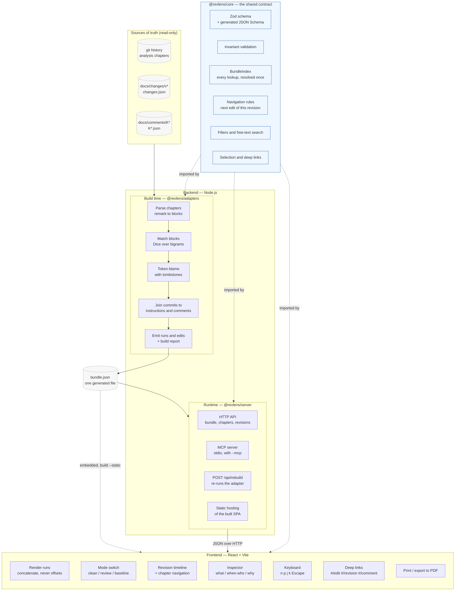
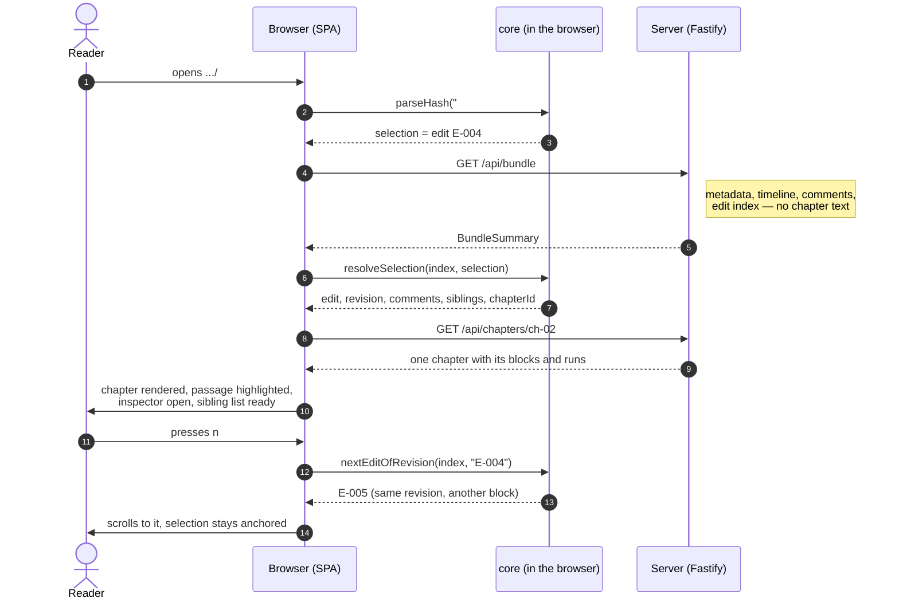
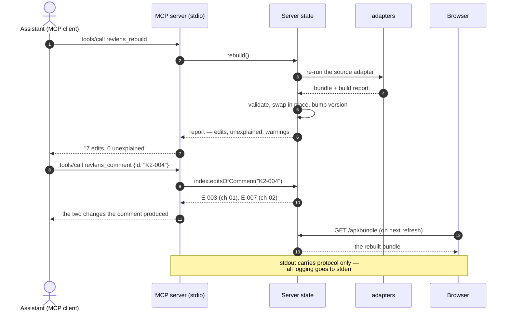
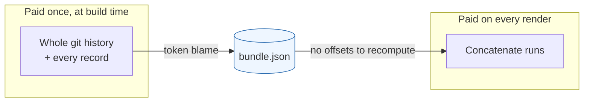

# RevLens Architecture

## Overview

How the work is split between the backend and the frontend, and why it is split there.

The short version: **the backend decides what the changes are, the frontend decides how
they are read, and `core` owns every rule both of them have to agree on.** Attribution is
resolved once at build time, so the browser never does offset arithmetic and a highlight
cannot drift out of alignment. Navigation and filtering live in `core` rather than in the
browser, because the HTTP API and the MCP tools answer the same questions and an assistant
that disagreed with the reader about which edits a revision produced would make the tool
useless as evidence.

The decisions behind this shape are recorded in
[ADR-004](docs/adr/ADR-004-revlens-attribution-token-blame.md) (the
attribution algorithm) and
[ADR-005](docs/adr/ADR-005-revlens-node-workspace-packaging.md) (the
runtime and packaging).

## Responsibility Split

## Who Owns What

| Concern | Backend | `core` | Frontend | Why there |
| ------- | ------- | ------ | -------- | --------- |
| Reading git and the record files | yes | no | no | The browser has no filesystem, and the repository is the source of truth |
| Deciding which revision produced which text | yes | no | no | Attribution needs the whole history; it is resolved once, at build time |
| The data contract | no | yes | no | Authored in Zod, the JSON Schema generated from it, so types and schema cannot drift |
| Invariant validation | runs it | defines it | runs it | The CLI validates before writing, the viewer refuses a bundle it cannot trust |
| "Next edit of this revision" | no | yes | calls it | The HTTP API, the MCP tools and the browser must give the same answer |
| Filters and free-text search | no | yes | calls it | Same reason; the count a reader sees and the count an assistant reports are one number |
| Rendering runs into text | no | supplies the rule | yes | Concatenating non-deleted runs is the whole renderer |
| Mode switch, scrolling, keyboard, printing | no | no | yes | Reading decisions, with no bearing on what the changes are |
| Deep-link format | no | yes | parses it | A link pasted into an e-mail must open the same thing on a cold load |
| Serving the SPA and the bundle | yes | no | no | Local, bound to `127.0.0.1`; the material is internal |
| Driving the tool from an assistant | yes (`--mcp`) | supplies the answers | no | The MCP surface is a projection of `core`, not a second implementation |
| Opening a bundle in an editor | the extension reads the file | validates it | renders it unchanged | An editor is a third host for the same frontend, not a second viewer |

## Three Hosts, One Frontend

The viewer in `apps/web` runs in three places and is written once:

| Host | Where the bundle comes from | What starts it |
| ---- | --------------------------- | -------------- |
| A browser tab | `GET /api/bundle`, chapters on demand | `revlens serve` |
| A directory that can be zipped | `bundle-data.js`, on a global | `revlens build --static` |
| An editor tab | the same global, written into the page | the extension in `apps/vscode` |

`detectSource()` in `apps/web/src/data/source.ts` is the whole seam: a bundle on the global
wins over the API. It was written so that a `file://` page could work without fetching -
which turns out to be exactly the constraint a webview has, so the editor needed no change
to the viewer at all.

That extension is one extension for two applications, Visual Studio Code and Pilot, because
Pilot runs real `.vsix` extensions on a subset of the API. The document path uses only what
both hosts have; everything beyond it is probed for rather than assumed. See
[ADR-006](docs/adr/ADR-006-standalone-product-and-editor-extensions.md).

## Cold Load of a Deep Link

A link to one change, pasted into an e-mail, has to open that change in a 150-page
document without loading the document first.

## Rebuild Driven by an Assistant

With `--mcp` the same process serves the browser and the assistant, so there is one
bundle and one rebuild — no second copy that can go stale.

## Why the Bundle Sits in the Middle

Everything that is hard — walking the history, matching blocks across rewrites, carrying
attribution forward through later edits — happens once and lands in a file. Everything
the reader triggers is a lookup in a map or a concatenation of strings. That is the whole
performance story: the tool is fast on a 150-page document because the browser was never
asked to do the difficult part.

---

**Created**: 2026-09-16
**Last Updated**: 2026-09-16
