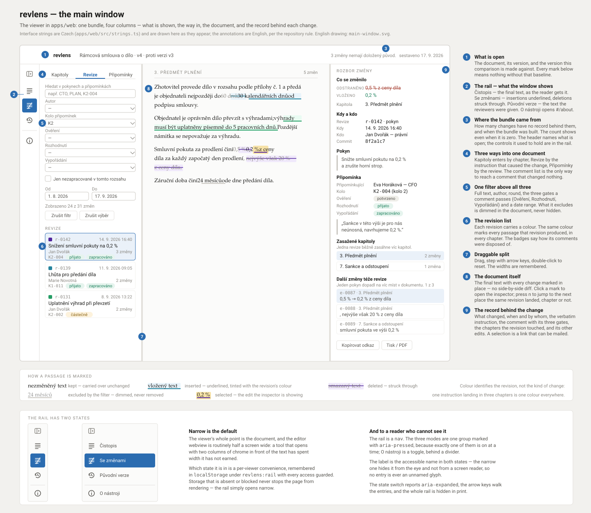
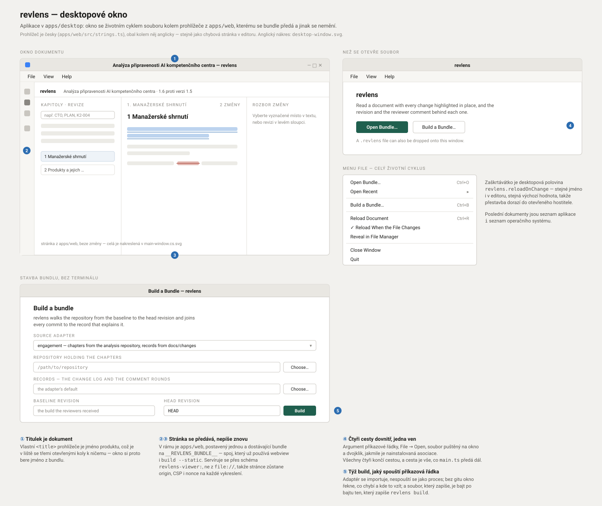

# revlens

> Tento soubor je **český překlad** dokumentu [`README.md`](README.md) (anglický originál —
> zdroj pravdy). Při jakékoli úpravě obsahu synchronizuj obě verze; pokud se rozcházejí,
> platí anglická.


## Přehled

- **Repozitář**: `revlens`
- **Jazyk**: TypeScript na Node.js 26.9+, npm workspaces
- **Stav**: začátek

Prohlížeč revizí dokumentu. Ukazuje **finální text tak, jak ho čtenář dostane**, s každou
změnou, která k němu vedla, zvýrazněnou přímo na místě — a u každé změny říká, kdy
nastala, kdo ji způsobil a na základě které připomínky.

Čtenář otevírá dokument, ne diff. Kliknutí na označenou pasáž odpoví na tři otázky
v jednom panelu a odtud se čtenář posune na **další změnu, kterou tatáž revize způsobila
jinde v dokumentu**. Jeden pokyn obvykle dopadne na několik míst; učinit revizi čitelnou
jako jeden akt, a ne jako rozsypané úpravy, je smysl celého nástroje.

Specifikace je [INT-002](docs/issues/002-document-revision-viewer.md). Dělba práce mezi
backendem a frontendem je nakreslená v [ARCHITECTURE.cs.md](ARCHITECTURE.cs.md); dvě
rozhodnutí, která za ní stojí, jsou
[ADR-004](docs/adr/ADR-004-revlens-attribution-token-blame.md) (token blame s tombstones) a
[ADR-005](docs/adr/ADR-005-revlens-node-workspace-packaging.md) (Node workspace);
osamostatnění nástroje do vlastního produktu je
[ADR-006](docs/adr/ADR-006-standalone-product-and-editor-extensions.md).

## Rychlý start

```bash
npm install
npm run build
```

Postav bundle z repozitáře a přečti ho:

```bash
node apps/cli/bin/revlens.js build \
  --source engagement \
  --repo <repozitář s kapitolami> \
  --records <repozitář se záznamy> \
  --from <výchozí commit> \
  --out out/analysis.revlens \
  --report out/analysis-report.json

node apps/cli/bin/revlens.js serve out/analysis.revlens
```

Prohlížeč se otevře na `http://127.0.0.1:4173/`. Naslouchá se ve výchozím stavu na
loopbacku a materiál je interní — neměň to, dokud nepadne rozhodnutí publikovat.

**Bez vlastního repozitáře** spusť místo toho hotový příklad — tři kapitoly, pět pokynů
a čtyři připomínky, vymyšlené od začátku do konce:

```bash
make demo                 # přeloží, postaví příklad, otevře prohlížeč
make demo LANGUAGE=cs     # tatáž zakázka, napsaná česky
```

`make help` vypíše všechny cíle; [`examples/`](examples/README.md) říká, co příklad
obsahuje a proč je v něm každý záznam.

## Čtení v editoru

Tentýž dokument se otevře uvnitř editoru, bez běžícího serveru:

```bash
npm run package:vsix                                   # dist/extension/cassandragargoyle.revlens-<verze>.vsix
code --install-extension dist/cassandragargoyle.revlens-0.1.0.vsix
```

Pak otevři libovolný soubor `*.revlens`. Bundle je vložený přímo do stránky, takže editor
nepotřebuje ani CLI, ani port; když se soubor přestaví, otevřená záložka se překreslí sama.

**Jedno rozšíření slouží dvěma aplikacím.** Visual Studio Code instaluje `.vsix` výše;
aplikace Pilot instaluje tentýž soubor z katalogu, protože umí spouštět skutečná
rozšíření VS Code na záměrně malé podmnožině API. Co se mezi nimi liší, je deklarované,
ne zakompilované: rozšíření se hostitele zeptá, co umí, a zaregistruje jen to — dokument
se tedy otevře vždy a položky v paletě příkazů se objeví jen tam, kde paleta příkazů je.

```bash
npm run package:pilot      # dist/extension/{*.vsix, catalog.json}
npm run verify:pilot-host  # spustí zabalené rozšíření na vlastním hostiteli Pilota
```

Co rozšíření přispívá, je v [`apps/vscode/README.md`](apps/vscode/README.md); instalace do
Pilota je v [`apps/pilot/README.md`](apps/pilot/README.md).

## Čtení bez editoru

Pro recenzenta, kterému někdo poslal soubor a který nemá ani checkout, ani editor, se
tentýž dokument otevře ve vlastní aplikaci:

```bash
make package-desktop   # dist/desktop/: AppImage na Linuxu, přenosné .exe a instalátor na Windows
```

Po instalaci si aplikace nárokuje `*.revlens`, takže se soubor otevře dvojklikem. Okno
soubor sleduje stejně jako záložka v editoru a **File → Build a Bundle…** spouští to, co
spouští `revlens build` — analytik, který připravuje kolo, vybere repozitář v dialogu
místo psaní šesti přepínačů a pošle jeden soubor místo adresářového stromu.

Stránka v okně je opět prohlížeč z `apps/web`, beze změny. Viz
[`apps/desktop/README.md`](apps/desktop/README.md) a
[ADR-007](docs/adr/ADR-007-desktop-application-for-readers.md), kde je vysvětleno, proč
primárním cílem zůstává editor.

## Příkazy

| Příkaz | Co dělá |
| ------ | ------- |
| `revlens sources` | Vypíše zdrojové adaptéry, které tento build zná |
| `revlens build` | Projde repozitář a zapíše bundle a k tomu build report |
| `revlens build --static [dir]` | Navíc zapíše samostatný adresář, který nepotřebuje server |
| `revlens validate <bundle>` | Zkontroluje bundle proti schématu **a** proti invariantům |
| `revlens serve <bundle>` | Servíruje prohlížeč a read-only API na `127.0.0.1` |
| `revlens serve <bundle> --mcp` | Navíc mluví MCP po stdio, takže nástroj může řídit asistent |

`revlens build` odmítne zapsat bundle, který neprojde vlastními invarianty.
`--allow-invalid` to přebije a je určený k tomu, aby se člověk podíval, co se pokazilo —
ne k předání výsledku dál.

### Přestavění, zatímco se dokument edituje

`serve` načte soubor s bundlem znovu na `POST /api/rebuild`. Když dostane i volby zdroje,
spustí místo toho znovu adaptér, takže se prohlížeč obnoví bez restartu:

```bash
node apps/cli/bin/revlens.js serve out/analysis.json \
  --source engagement --repo <repozitář s analýzou> --records <repozitář se záznamy> --from <výchozí commit>
```

## Řízení z asistenta

```bash
node apps/cli/bin/revlens.js serve out/analysis.json --mcp
```

HTTP server běží dál, takže tentýž proces obsluhuje prohlížeč i asistenta — jeden bundle,
jeden rebuild, žádná druhá kopie, která by mohla zastarat. **Se zapnutým `--mcp` se na
stdout nepíše nic než protokol**; všechno, co by CLI vypsalo, jde na stderr.

| Nástroj | Odpovídá na |
| ------- | ----------- |
| `revlens_document` | Co je tento dokument, které kapitoly nesou kolik změn, celkové součty |
| `revlens_chapter` | Jedna kapitola jako text, v režimu čistopis, se změnami nebo původní verze |
| `revlens_revision` | Jedna revize s pokynem, připomínkami a všemi změnami, které vyrobila |
| `revlens_comment` | Co připomínka způsobila — otázka „zapracoval někdo mou připomínku, a kde" |
| `revlens_comments` | Procházení připomínkového řízení: každá připomínka se třemi stupni, filtrovatelně. `landed=false` znamená „rozhodnuto a nikdy nezapracováno" |
| `revlens_edit` | Jedna změna: vložený a odebraný text, revize, připomínka, sourozenci |
| `revlens_search` | Změny podle revize, autora, kola, připomínky, kapitoly, časového rozsahu a fulltextu |
| `revlens_validate` | Report schématu a invariantů a které změny zůstaly nedoložené |
| `revlens_rebuild` | Spustí znovu adaptér a vymění výsledek |

Všechno kromě `revlens_rebuild` je jen pro čtení a každý nástroj je projekcí
`@revlens/core` — asistent i čtenář volají tytéž funkce, takže se nemohou rozejít v tom,
které změny která revize vyrobila.

Registrace u lokálního asistenta: nasměruj klienta na
`node <cesta>/revlens/apps/cli/bin/revlens.js serve <bundle> --mcp`.

## Čtení dokumentu

| Klávesa | Co dělá |
| ------- | ------- |
| kliknutí | Vybere označenou pasáž a otevře panel s rozborem |
| `n` / `p` | Další / předchozí změna **vybrané revize**, kdekoli v dokumentu |
| `j` / `k` | Další / předchozí změna v pořadí dokumentu, bez ohledu na revizi |
| `Escape` | Zruší výběr a vrátí nefiltrovaný dokument |
| tažení dělicí čáry | Mění šířku postranního sloupce; šipky s ní hýbou po krocích a Home ji vrátí zpět |

Přepínač režimu přepíná mezi **Čistopisem** (finální text), **Se změnami** (vložený text
podtržený, smazaný přeškrtnutý) a **Původní verzí** (text ve znění, které dostali
recenzenti). Každý výběr má adresu — `#/edit/E-9e4b152a`, `#/revision/R-125cbec5`,
`#/comment/K1-002` — takže odkaz na jednu změnu se dá vložit do e-mailu a tutéž změnu
otevře i po přestavění bundlu (viz [Identifikátory](#identifikátory)).

Levý sloupec nabízí tři cesty dovnitř. **Kapitoly** a **Revize** vedou přes text,
**Připomínky** přes připomínkové řízení. Oba postranní sloupce jdou zvětšit — název
kapitoly a třířádkové shrnutí připomínky nechtějí stejnou šířku — a šířka se pamatuje
pro každý prohlížeč zvlášť.

Řetězce rozhraní jsou české a leží v `apps/web/src/strings.ts`. Kód, identifikátory,
komentáře a dokumentace jsou anglické, podle pravidel repozitáře.

## Procházení připomínek

Text odpovídá na otázku „co vyrobilo tuhle pasáž". Připomínkové řízení odpovídá na otázku
opačnou — **co se stalo se vším, co přišlo zpátky** — a je nutné ji položit zvlášť,
protože připomínka, která nevyrobila žádnou změnu, je v dokumentu z definice neviditelná.
A právě ta bývá ta, kterou stojí za to najít.

Záznamy vedou připomínku třemi stupni. Odpovídají na různé otázky a mohou si odporovat,
takže prohlížeč ukazuje a filtruje všechny tři:

| Stupeň | Pole | Otázka | Hodnoty v zakázce |
| ------ | ---- | ------ | ----------------- |
| **Ověření** | `check.verdict` | Je námitka oprávněná? | `potvrzeno`, `potvrzeno-s-upresnenim`, `mimo-text`, `neplati` |
| **Rozhodnutí** | `decision.status` | Jak jsme se rozhodli? | `prijato`, `prijato-castecne`, `zamitnuto`, `odlozeno`, `nerozhodnuto` |
| **Vypořádání** | `resolution.state` | Je to zapracované? | `hotovo`, `rozpracovano`, `nezahajeno`, `odpada` |

Připomínka může být potvrzená, přijatá — a přesto nezapracovaná.

**„Nevyrobila žádnou změnu" není totéž co „stále otevřená".** Připomínka vypořádaná před
výchozím stavem také nevyrobila žádnou změnu *tady* — její úpravy jsou uvnitř textu, od
kterého srovnání začíná, takže se objevit ani nemohla. Ptát se jen na `landed=false` obojí
slévá dohromady a mění strukturální fakt ve falešný poplach: na zakázce je taková odpověď
92 ze 140, zatímco číslo, které něco znamená, je 27.

```bash
# připomínky, ke kterým se tohle srovnání může vyjádřit a které nic nevyrobily
curl '127.0.0.1:4173/api/comments?landed=false'

# přijaté a stále nedokončené
curl '127.0.0.1:4173/api/comments?decision=prijato&resolution=rozpracovano'

# kola uzavřená před výchozím stavem, ve výchozím nastavení skrytá
curl '127.0.0.1:4173/api/comments?scope=settled-earlier'
```

### Rozsah: k čemu se srovnání může vyjádřit

Bundle nese **všechny připomínky, které kdy zakázka dostala**, včetně celých kol
uzavřených před výchozím stavem. Ty patří k dřívějšímu srovnání a jejich vypisování
zavalí ty, o které jde v tomhle bundlu — na zakázce 65 ze 140.

Prohlížeč, API i `revlens_comments` proto ve výchozím stavu používají **`in-range`**
a říkají to ve své odpovědi; `scope=settled-earlier` nebo `scope=all` rozsah rozšíří.
Z bundlu se nic neodstraňuje: `#/comment/K-001` se pořád rozřeší a jeho panel vysvětlí,
proč je mimo rozsah.

Hranici určuje **to, kdy byla připomínka uzavřena, ne kdy přišla**, a změna v tomto bundlu
datum přebíjí: pokud na připomínku odpovídá úprava tady, čtenář se dívá na tu změnu, ať už
razítko v záznamu říká cokoli. `settled-earlier` znamená *uzavřeno dřív, než tohle srovnání
začíná* — což není totéž co *zapracováno do textu*, a formulace to nikdy netvrdí.

## Identifikátory

`E-001`, `E-002`, … v pořadí dokumentu se dobře čte a jako adresa je to k ničemu: změň
výchozí stav a `E-050` je jiná změna. **Identifikátory se proto odvozují z toho, co ta
změna je.**

| Id | Odvozeno z | Přežije přestavění? |
| -- | ---------- | ------------------- |
| `E-9e4b152a` | své revize, svého druhu a textu, který vložila a odebrala | ano |
| `R-125cbec5` | záznamu za revizí **a** plného hashe commitu | ano |
| `ch-04-wp-a1` | čte se z `analysis/structure.json` | ano |
| `K11-122` | čte se ze záznamů připomínek | ano |
| `ch-04-wp-a1/b-17` | přiděleno nad výchozím stavem a neseno dál | **ne** — id bloků platí jen v rámci buildu |

Pozice v dokumentu žije v `order`, což je místo, kam pozice patří.

**Známá hranice.** Dvě bajtově shodné změny jedné revize se od sebe liší jen pořadím mezi
sebou. Pokud jedna z nich v jednom buildu je a v druhém ne, nic nedokáže říct, která
z těch dvou přežila. Změřeno na zakázce — build z výchozího stavu 1.5 proti buildu
z prvního commitu kapitoly — **100 ze 102 změn přítomných v obou si drží stejné id**
a všech 15 společných revizí také.

## Rozvržení repozitáře

```text
revlens/
  schema/bundle.schema.json   # generováno ze Zod schématu v core - needitovat
  fixtures/sample-bundle.json # anonymizovaný vzorek; fixture pro unit testy
  examples/                   # celé zakázky, ze kterých jde postavit bundle a spustit ho
  Makefile                    # make demo - přeloží, postaví příklad, otevře prohlížeč
  packages/
    core/                     # kontrakt, validace, indexy, navigace, filtry
    adapters/                 # git a Markdown, token blame, spojení se záznamy
    viewer-page/              # stránka, kterou hostitel vloží, a soubor za ní
  apps/
    cli/                      # revlens build | validate | serve | sources
    server/                   # read-only API nad Fastify, statické hostování, MCP server
    web/                      # prohlížeč v Reactu a Vite
    vscode/                   # rozšíření editoru, pro VS Code i pro Pilota
    pilot/                    # cíl Pilot: katalog, balení, ověření hostitele
    desktop/                  # obal v Electronu: okno, soubor, instalátor
  docs/
    adr/                      # rozhodnutí, ze kterých vzešel tvar nástroje
    issues/                   # INT-002, specifikace
  scripts/
    generate-schema.ts        # zapisuje schema/bundle.schema.json z core
    seed-example.ts           # přehraje snapshoty příkladu do skutečné git historie
    validate-records.ts       # kontroluje příklady proti schema/records
    bench-bundle.ts           # měří, co prohlížeč dělá při studeném startu
    package-extension.ts      # sestaví a zabalí .vsix, který instalují oba hostitelé
```

`core` je jediný balíček, na kterém závisí server i webová aplikace, takže navigační
pravidla jsou napsaná jednou a otestovaná bez prohlížeče.

## Datový kontrakt

Jeden JSON bundle na dokument. Tvar popisuje
[`fixtures/README.md`](fixtures/README.md) a vynucuje
[`schema/bundle.schema.json`](schema/bundle.schema.json).

**Schéma se generuje** ze Zod schématu v `packages/core/src/schema.ts` příkazem
`npm run schema`; ruční úprava se při dalším buildu ztratí a `npm run schema:check` v CI
selže, jakmile se odevzdaný soubor rozejde. Kontrakt se mění v `core` — a změna kontraktu
je zároveň změnou INT-002.

Tři rozhodnutí za tímto tvarem:

- **Atribuce sedí v textu, ne vedle něj.** Blok je seznam runs, každý `kept`, `inserted`
  nebo `deleted`. Vykreslení je zřetězení nesmazaných runs — žádné počítání offsetů, žádná
  možnost, aby se zvýraznění posunulo mimo.
- **`edits` je páteř navigace**, v pořadí dokumentu. `revisions[].edits` je přesně to, co
  obchází tlačítko „další změna této revize".
- **Smazání se neztrácí.** Smazaný run zůstává na místě, ze kterého byl odebrán. Bez toho
  nejde odpovědět na otázku „co vlastně moje připomínka odstranila".

## Jak vzniká bundle

Builder projde commity od výchozího stavu k hlavě, **od nejstaršího**, a drží
atribuovaný seznam tokenů pro každý blok — viz
[ADR-004](docs/adr/ADR-004-revlens-attribution-token-blame.md). Stručně: vložené tokeny
dostanou aktuální revizi, smazané tokeny se stanou **tombstones** nesenými na pozici, ze
které byly odebrány, a přeživší tokeny si nechají atribuci, kterou už měly. Právě ta
poslední věta umožňuje zvýraznit změnu tři revize starou tam, kde dnes leží.

Text vložený po výchozím stavu a odebraný před hlavou se ke čtenáři nikdy nedostal.
Z bundlu vypadne a **v build reportu se započítá** jako churn, takže sled „přidáno a zase
odebráno" je vidět, aniž by zaneřádil dokument.

### Čtení build reportu

Číslo, na kterém záleží, je **unexplained** — změny, za jejichž revizí není žádný záznam.
Tiskne se, ať už je nulové, nebo ne, protože report, který zmiňuje jen problémy, by nechal
neúplné spojení vypadat jako úplné. Report také uvádí, kolik commitů bylo spojeno podle
hashe, kolik podle cílové cesty a data a kolik podle vypořádání připomínky; spojení, které
hádalo, není spojení, které bylo zaznamenáno, a report říká, o které z nich šlo.

## Přidání zdroje

Zdrojový adaptér implementuje `SourceAdapter` v
`packages/adapters/src/sources/types.ts` a vrací dvě věci: kapitoly, které se mají projít,
a to, co vysvětluje každý commit. Nevyrábí žádné runs, změny ani atribuci — to je pro
každý zdroj stejné. Zaregistruj ho v `packages/adapters/src/sources/registry.ts`.

Čtení revizí ve Wordu (`w:ins` / `w:del`) by byl druhý adaptér, pokrývající dokumenty,
které nikdy nežily v gitu. Pro tuhle verzi je mimo rozsah a kontrakt to neznemožňuje.

## Vývoj

```bash
npm run build       # tsc -b, přegenerování schématu, build prohlížeče a rozšíření
npm test            # vitest, nad zdroji, ne nad výstupem buildu
npm run lint        # eslint
npm run typecheck   # workspace plus rozšíření a cíl Pilot
npm run schema      # přepíše schema/bundle.schema.json ze Zod schématu
npm run bench -- out/analysis.revlens   # co prohlížeč dělá při studeném startu
npm run dev         # vite dev server, proxuje /api na běžící `revlens serve`
npm run watch:vscode                    # přestaví rozšíření při každé změně
```

CI spouští lint, typecheck, build, kontrolu schématu, testy a zabalení rozšíření — viz
[`.github/workflows/ci.yml`](.github/workflows/ci.yml).

### Co testy pokrývají

- `packages/core` — kontrakt, invarianty, navigace, filtry, deep linky
- `packages/adapters` — tokenizace, word diff, podobnost, token blame a builder od začátku
  do konce nad vymyšlenou git historií o pěti commitech
- `apps/server` — read-only API přes injection ve Fastify a MCP nástroje přes skutečného
  MCP klienta nad in-memory transportem
- `apps/cli` — samostatný statický export
- `apps/web` — prohlížeč v jsdom: klikání, krokování, deep linky, režimy a filtry

Výkonový test v `apps/web/test/performance.test.tsx` měří první vykreslení nad skutečným
bundlem. Bundly jsou artefakty buildu a neodevzdávají se, takže když žádný není, test se
přeskočí — a řekne to, místo aby tiše prošel.

## Co nástroj nedělá

- **Není editor.** Nic v UI do dokumentu nezapisuje; zdrojem pravdy zůstává repozitář.
- **Nenahrazuje wordovské porovnání.** To, co jde ke klientovi, zůstává wordovský soubor
  se skutečnými revizemi, které může přijmout a odmítnout. `revlens` je pohled ke čtení.
- **Žádná autentizace, žádné hostování.** Lokální nástroj, lokální bind. Vystavit ho
  klientovi na URL je samostatné rozhodnutí se samostatným issue.

## Hlavní okno



Obrázek ukazuje rozhraní tak, jak ho čtenář vidí. Táž kresba s popisky přeloženými do
angličtiny je [main-window.svg](docs/architecture/ui/main-window.svg).

## Desktopové okno



Obal kolem prohlížeče je anglicky, stejně jako chybová stránka v editoru; prohlížeč uvnitř
je česky. Anglická kresba je
[desktop-window.svg](docs/architecture/ui/desktop-window.svg).

---

**Vytvořeno**: 2026-09-17
**Poslední aktualizace**: 2026-09-17
