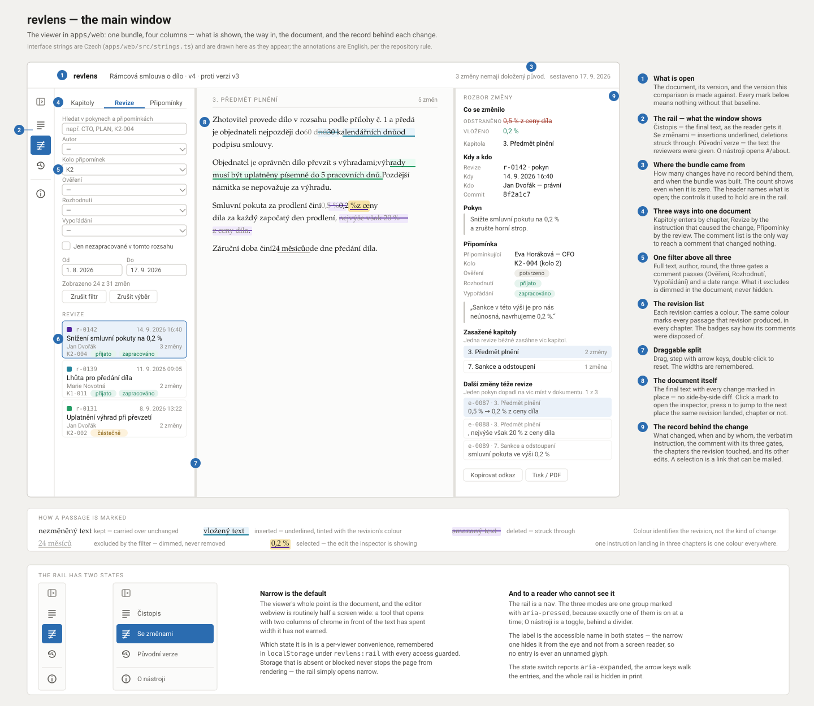
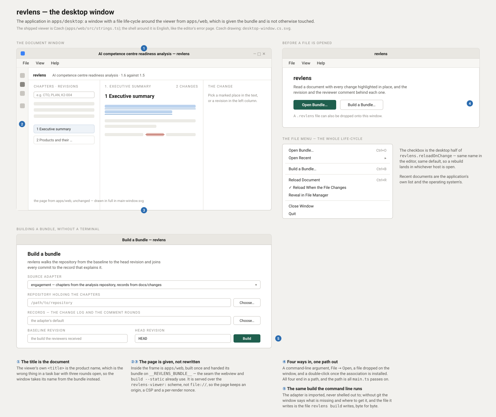

# revlens

*Česky: [README.cs.md](README.cs.md).*


## Overview

**Repository**: `revlens`
**Language**: TypeScript on Node.js 26.9+, npm workspaces
**Status**: Early

A document revision viewer. It shows **the final text as the reader gets it**, with every
change that produced it highlighted in place, and — for each change — when it happened,
who caused it, and on the basis of which reviewer comment.

The reader opens the document, not a diff. Clicking a marked passage answers three
questions in one panel, and from there the reader steps to **the next change the same
revision caused elsewhere in the document**. One instruction usually lands in several
places; making a revision readable as one act instead of as scattered edits is the point
of the whole tool.

Specified in
[INT-002](docs/issues/002-document-revision-viewer.md). The split of
work between the backend and the frontend is drawn in [ARCHITECTURE.md](ARCHITECTURE.md);
the two decisions behind it are
[ADR-004](docs/adr/ADR-004-revlens-attribution-token-blame.md) (token
blame with tombstones) and
[ADR-005](docs/adr/ADR-005-revlens-node-workspace-packaging.md) (a Node
workspace), and the move out of that workspace into a product of its own is
[ADR-006](docs/adr/ADR-006-standalone-product-and-editor-extensions.md).

## Quick Start

```bash
npm install
npm run build
```

Build a bundle from a repository, then read it:

```bash
node apps/cli/bin/revlens.js build \
  --source engagement \
  --repo <repository holding the chapters> \
  --records <repository holding the records> \
  --from <baseline-commit> \
  --out out/analysis.revlens \
  --report out/analysis-report.json

node apps/cli/bin/revlens.js serve out/analysis.revlens
```

The viewer opens at `http://127.0.0.1:4173/`. The bind address is the loopback interface
by default and the material is internal — do not change it without deciding to publish.

**With no repository of your own**, run the worked example instead — three chapters, five
instructions and four reviewer comments, invented from end to end:

```bash
make demo                 # compile, build the example, open the viewer
make demo LANGUAGE=cs     # the same engagement, written in Czech
```

`make help` lists every target; [`examples/`](examples/README.md) says what the example
contains and why each record in it is there.

## Reading It in an Editor

The same document opens inside an editor, with no server running:

```bash
npm run package:vsix                                   # dist/extension/cassandragargoyle.revlens-<version>.vsix
code --install-extension dist/cassandragargoyle.revlens-0.1.0.vsix
```

Then open any `*.revlens` file. The bundle is embedded in the page, so the editor needs
neither the CLI nor a port; when the file is rebuilt, the open tab re-renders itself.

**One extension serves two applications.** Visual Studio Code installs the `.vsix` above;
the Pilot application installs the very same file from a catalog, because it runs real VS
Code extensions on a deliberately small subset of the API. What differs between the two is
declared rather than compiled: the extension asks the host what it can do and registers
only that, so the document always opens and the command-palette entries appear only where
there is a command palette.

```bash
npm run package:pilot      # dist/extension/{*.vsix, catalog.json}
npm run verify:pilot-host  # runs the packaged extension on Pilot's own host
```

See [`apps/vscode/README.md`](apps/vscode/README.md) for what the extension contributes,
and [`apps/pilot/README.md`](apps/pilot/README.md) for installing it into Pilot.

## Reading It Without an Editor

For the reviewer who was sent a file and has neither a checkout nor an editor, the same
document opens in an application of its own:

```bash
make package-desktop   # dist/desktop/: an AppImage on Linux, a portable .exe and an installer on Windows
```

Installed, it claims `*.revlens`, so the file is opened by double-clicking it. The window
follows the file the way the editor tab does, and **File → Build a Bundle…** runs what
`revlens build` runs — the analyst who prepares a round picks a repository in a dialog
instead of writing six flags, and sends one file rather than a directory tree.

The page in the window is the viewer from `apps/web` again, unchanged. See
[`apps/desktop/README.md`](apps/desktop/README.md), and
[ADR-007](docs/adr/ADR-007-desktop-application-for-readers.md) for why the editor stays the
primary target.

## Commands

| Command | What it does |
| ------- | ------------ |
| `revlens sources` | Lists the source adapters this build knows |
| `revlens build` | Walks a repository and writes a bundle, plus a build report |
| `revlens build --static [dir]` | Also writes a self-contained directory that needs no server |
| `revlens validate <bundle>` | Checks a bundle against the schema **and** the invariants |
| `revlens serve <bundle>` | Serves the viewer and the read-only API on `127.0.0.1` |
| `revlens serve <bundle> --mcp` | Additionally speaks MCP on stdio, so an assistant can drive the tool |

`revlens build` refuses to write a bundle that fails its own invariants. `--allow-invalid`
overrides that, and is for looking at what went wrong rather than for shipping.

### Rebuilding while the document is being edited

`serve` re-reads the bundle file on `POST /api/rebuild`. Given the source options as well,
it re-runs the adapter instead, so the viewer refreshes without restarting:

```bash
node apps/cli/bin/revlens.js serve out/analysis.json \
  --source engagement --repo <analysis-repo> --records <engagement-repo> --from <baseline>
```

## Driving It from an Assistant

```bash
node apps/cli/bin/revlens.js serve out/analysis.json --mcp
```

The HTTP server keeps running, so the same process serves the browser and the assistant —
one bundle, one rebuild, no second copy that can go stale. **With `--mcp` on, nothing but
the protocol is written to stdout**; everything the CLI would have printed goes to stderr.

| Tool | Answers |
| ---- | ------- |
| `revlens_document` | What this document is, which chapters carry how many changes, the totals |
| `revlens_chapter` | One chapter as text, in clean, review or baseline mode |
| `revlens_revision` | One revision with its instruction, its comments and every change it produced |
| `revlens_comment` | What a reviewer comment produced — the "did anyone act on my comment, and where" question |
| `revlens_comments` | Browses the review: every comment with its three gates, filterable. `landed=false` is "decided and never worked in" |
| `revlens_edit` | One change: inserted and removed text, the revision, the comment, the siblings |
| `revlens_search` | Changes by revision, author, round, comment, chapter, date range and free text |
| `revlens_validate` | Schema and invariant report, and which edits stayed unexplained |
| `revlens_rebuild` | Re-runs the adapter and swaps the result in |

Everything except `revlens_rebuild` is read-only, and every tool is a projection of
`@revlens/core` — the assistant and the reader call the same functions, so they cannot
disagree about which edits a revision produced.

To register it with a local assistant, point the client at
`node <path>/revlens/apps/cli/bin/revlens.js serve <bundle> --mcp`.

## Reading the Document

| Key | Does |
| --- | ---- |
| click | Selects the marked passage and opens the inspector |
| `n` / `p` | Next / previous change **of the selected revision**, anywhere in the document |
| `j` / `k` | Next / previous change in document order, regardless of revision |
| `Escape` | Clears the selection and returns to the unfiltered document |
| drag the divider | Changes a side column's width; the arrow keys move it in steps and Home puts it back |

The mode switch flips between **Čistopis** (the final text), **Se změnami** (insertions
underlined, deletions struck through) and **Původní verze** (the text the reviewers
received). Every selection is addressable — `#/edit/E-9e4b152a`, `#/revision/R-125cbec5`,
`#/comment/K1-002` — so a link to one change can be pasted into an e-mail, and it still
opens that change after the bundle is rebuilt (see [Identifiers](#identifiers)).

The left column has three ways in. **Kapitoly** and **Revize** enter through the text;
**Připomínky** enters through the review. Both side columns are resizable — a chapter
title and a three-line comment summary do not want the same width — and the width is
remembered per browser.

UI strings are Czech, held in `apps/web/src/strings.ts`. Code, identifiers, comments and
documentation are English, per the repository rules.

## Browsing the Review

The text answers "what produced this passage". The review answers the opposite question -
**what became of everything that came back** - and it has to be asked separately, because
a comment that produced no change is invisible in the document by definition. That is
usually the one worth finding.

The records take a comment through three gates. They answer different questions and can
disagree, so the viewer shows and filters all three:

| Gate | Field | Question | Values in the engagement |
| ---- | ----- | -------- | ------------------------ |
| **Ověření** | `check.verdict` | Is the objection right? | `potvrzeno`, `potvrzeno-s-upresnenim`, `mimo-text`, `neplati` |
| **Rozhodnutí** | `decision.status` | What did we decide? | `prijato`, `prijato-castecne`, `zamitnuto`, `odlozeno`, `nerozhodnuto` |
| **Vypořádání** | `resolution.state` | Has it been worked in? | `hotovo`, `rozpracovano`, `nezahajeno`, `odpada` |

A comment can be confirmed, accepted and still not worked in.

**"Produced no change" is not the same as "still open".** A comment settled before the
baseline also produced no change *here* — its edits are inside the text the comparison
starts from, so it could never appear. Asking for `landed=false` alone conflates the two
and turns a structural fact into a false alarm: on the engagement it answers 92 of 140,
where the number that means something is 27.

```bash
# the comments this comparison can speak to, that produced nothing
curl '127.0.0.1:4173/api/comments?landed=false'

# accepted, and still not finished
curl '127.0.0.1:4173/api/comments?decision=prijato&resolution=rozpracovano'

# the rounds closed before the baseline, which are hidden by default
curl '127.0.0.1:4173/api/comments?scope=settled-earlier'
```

### Scope: what the comparison can speak to

A bundle carries **every comment the engagement ever received**, including whole rounds
closed before the baseline. Those belong to an earlier comparison, and listing them buries
the ones this bundle is about — on the engagement, 65 of 140.

The browser, the API and `revlens_comments` therefore default to **`in-range`** and say so
in their answer; `scope=settled-earlier` or `scope=all` widens it. Nothing is removed from
the bundle: `#/comment/K-001` still resolves, and its panel explains why it is out of scope.

The line is drawn by **when a comment was closed, not when it arrived**, and a change in
this bundle overrules the date: if an edit here answers the comment, the reader is looking
at that change, whatever the record's timestamp says. `settled-earlier` means *closed
before this comparison starts* — which is not the same as *worked into the text*, and the
wording never claims it is.

## Identifiers

`E-001`, `E-002`, … in document order reads well and is useless as an address: change the
baseline and `E-050` is a different change. **Ids are therefore derived from what the
change is.**

| Id | Derived from | Stable across a rebuild? |
| -- | ------------ | ------------------------ |
| `E-9e4b152a` | its revision, its kind, and the text it inserted and removed | yes |
| `R-125cbec5` | the record behind the revision **and** the full commit hash | yes |
| `ch-04-wp-a1` | read from `analysis/structure.json` | yes |
| `K11-122` | read from the comment records | yes |
| `ch-04-wp-a1/b-17` | assigned on the baseline and carried forward | **no** — block ids are build-local |

Document position lives in `order`, which is where a position belongs.

**The known limit.** Two byte-identical changes of one revision are told apart only by
their rank among themselves. If one of them exists in one build and not in another,
nothing can say which of the two the survivor is. Measured on the engagement — a build
from the 1.5 baseline against one from the first chapter commit — **100 of the 102 changes
present in both keep the same id**, and all 15 shared revisions do.

## Layout

```text
revlens/
  schema/bundle.schema.json   # generated from the Zod schema in core - do not edit
  fixtures/sample-bundle.json # anonymized sample; the fixture of the unit tests
  examples/                   # complete engagements to build a bundle from, and run
  Makefile                    # make demo - compile, build the example, open the viewer
  packages/
    core/                     # contract, validation, indexes, navigation, filters
    adapters/                 # git and Markdown plumbing, token blame, record joins
    viewer-page/              # the page a host embeds, and the file behind it
  apps/
    cli/                      # revlens build | validate | serve | sources
    server/                   # Fastify read-only API, static hosting, MCP server
    web/                      # React + Vite viewer
    vscode/                   # the editor extension, for VS Code and for Pilot
    pilot/                    # the Pilot target: catalog, packaging, host verification
    desktop/                  # the Electron shell: a window, a file, an installer
  docs/
    adr/                      # the decisions behind the shape of the tool
    issues/                   # INT-002, the specification
  scripts/
    generate-schema.ts        # writes schema/bundle.schema.json from core
    seed-example.ts           # replays an example's snapshots into a real git history
    validate-records.ts       # checks the examples against schema/records
    bench-bundle.ts           # measures what the viewer does on a cold load
    package-extension.ts      # builds and packages the .vsix both hosts install
```

`core` is the only package both the server and the web app depend on, so the navigation
rules are written once and unit-tested without a browser.

## The Data Contract

One JSON bundle per document. The shape is described in
[`fixtures/README.md`](fixtures/README.md) and enforced by
[`schema/bundle.schema.json`](schema/bundle.schema.json).

**The schema is generated** from the Zod schema in `packages/core/src/schema.ts` by
`npm run schema`; editing it by hand is undone on the next build, and `npm run schema:check`
fails in CI when the committed file has drifted. Change the contract in `core`, and
remember that changing the contract is a change to INT-002.

Three decisions behind the shape:

- **Attribution sits in the text, not beside it.** A block is a list of runs, each `kept`,
  `inserted` or `deleted`. Rendering is concatenating the non-deleted runs — no offset
  arithmetic, no way for a highlight to drift out of alignment.
- **`edits` is the navigation spine**, in document order. `revisions[].edits` is exactly
  what the "next change of this revision" button walks.
- **Deletions are kept, not dropped.** A deleted run stays at the position it was removed
  from. Without it, "what did my comment actually remove" cannot be answered.

## How a Bundle Is Built

The builder walks the commits from the baseline to the head, **oldest first**, and keeps
an attributed token list per block — see
[ADR-004](docs/adr/ADR-004-revlens-attribution-token-blame.md). The
short version: inserted tokens take the current revision, deleted tokens become
**tombstones** carried at the position they were removed from, and surviving tokens keep
whatever attribution they already had. That last clause is what lets a change from three
revisions back be highlighted where it sits today.

Text inserted after the baseline and removed before the head never reached the reader. It
is dropped from the bundle and **counted in the build report** as churn, so a sequence of
"added then removed again" is visible without polluting the document.

### Reading the build report

The number that matters is **unexplained** — edits whose revision has no record behind it.
It is printed whether it is zero or not, because a report that only mentioned problems
would let an incomplete join look like a complete one. The report also states how many
commits were joined by hash, by target path and date, or by a comment resolution; a join
that guessed is not a join that was recorded, and the report says which it was.

## Adding a Source

A source adapter implements `SourceAdapter` in
`packages/adapters/src/sources/types.ts` and returns two things: the chapters to walk, and
what explains each commit. It produces no runs, edits or attribution — that is the same
for every source. Register it in `packages/adapters/src/sources/registry.ts`.

Reading Word tracked changes (`w:ins` / `w:del`) would be a second adapter, covering
documents that never lived in git. It is out of scope for this version, and the contract
does not make it impossible.

## Development

```bash
npm run build       # tsc -b, regenerate the schema, build the viewer and the extension
npm test            # vitest, over the sources rather than the build output
npm run lint        # eslint
npm run typecheck   # the workspace, plus the extension and the Pilot target
npm run schema      # rewrite schema/bundle.schema.json from the Zod schema
npm run bench -- out/analysis.revlens   # what the viewer does on a cold load
npm run dev         # vite dev server, proxying /api to a running `revlens serve`
npm run watch:vscode                    # rebuild the extension on change
```

CI runs lint, typecheck, build, the schema check, the tests and the packaging of the
extension — see [`.github/workflows/ci.yml`](.github/workflows/ci.yml).

### What the tests cover

- `packages/core` — the contract, the invariants, the navigation, the filters, deep links
- `packages/adapters` — tokenization, word diff, similarity, token blame, and the builder
  end to end over a fabricated five-commit git history
- `apps/server` — the read-only API through Fastify's injection, and the MCP tools through
  a real MCP client over an in-memory transport
- `apps/cli` — the self-contained static export
- `apps/web` — the viewer in jsdom: clicking, stepping, deep links, modes and filters

The performance test in `apps/web/test/performance.test.tsx` measures first paint on a
real bundle. Bundles are build artefacts and are not committed, so it skips when there is
none — and says so rather than passing quietly.

## Non-goals

- **Not an editor.** Nothing in the UI writes to the document; the repository stays the
  source of truth.
- **Not a replacement for the Word comparison.** What goes to the client stays a Word file
  with real tracked changes they can accept and reject. `revlens` is the reading view.
- **No authentication, no hosting.** Local tool, local bind. Publishing it to a URL for a
  client is a separate decision with a separate issue.

## The Main Window



The interface itself is Czech; the drawing above translates it. The same picture with the
strings the reader actually sees is
[main-window.cs.svg](docs/architecture/ui/main-window.cs.svg).

## The Desktop Window



The shell around the viewer is English, like the editor's error page; the viewer inside it
is Czech. The Czech drawing is
[desktop-window.cs.svg](docs/architecture/ui/desktop-window.cs.svg).

---

**Created**: 2026-09-16
**Last Updated**: 2026-09-17
